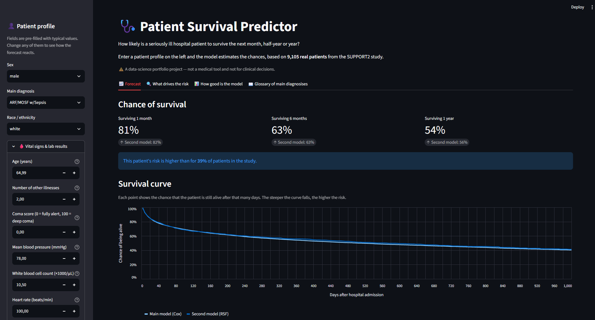

# 🩺 Patient Survival Predictor — SUPPORT2

Interactive Streamlit app that estimates how likely a seriously ill hospital patient is to survive
the next **1 month, 6 months and 1 year** — and explains *why*.

Built on the SUPPORT2 study (9,105 patients) with two survival models: **Cox Proportional Hazards**
and **Random Survival Forest**.

🔗 **Live app:** _add your link here after deployment_



## What the app does
- **Forecast** — enter a patient profile and get survival chances at 30 / 180 / 365 days plus a full survival curve
- **What drives the risk** — per-patient explanation of the top risk factors and risk multipliers (hazard ratios)
- **How good is the model** — test-set metrics explained in plain language
- **Glossary of main diagnosises** — the eight diagnosis groups translated into plain English

## Data
**SUPPORT2** — *Study to Understand Prognoses and Preferences for Outcomes and Risks of Treatments*:
9,105 seriously ill adults admitted to five US hospitals. Each patient has demographics,
diagnosis group, vital signs, lab results and follow-up time until death or end of observation.
About 68% of patients died during follow-up; the rest are **censored** (still alive at last contact),
which is why survival models are needed instead of ordinary classification.

## Method
1. **Features:** 16 numeric (age, comorbidities, coma score, vitals, labs) + 3 categorical (sex, diagnosis, race)
2. **Preprocessing:** median imputation and scaling for numbers, one-hot encoding for categories (scikit-learn pipeline)
3. **Split:** 75% train / 25% test, stratified by outcome
4. **Models:** Cox PH with L2 regularisation and Random Survival Forest (100 trees)
5. **Evaluation:** C-index, time-dependent AUC, Integrated Brier Score and a **calibration check at 180 days**
6. **Explainability:** SHAP values for both models

## Results (test set, 2,277 patients)

| Metric | Cox | RSF |
|---|---|---|
| C-index ↑ | 0.678 | 0.680 |
| Mean time-AUC ↑ | 0.729 | 0.729 |
| IBS ↓ | 0.199 | 0.194 |
| Calibration error at 180 days | ≤ 0.03 | up to 0.08 |

**Why Cox is the selected model:** both models rank patients equally well, and RSF has a slightly
lower average IBS. But the calibration plot shows that RSF pulls predictions towards the middle:
for the highest-risk patients it predicts 27% survival when the observed survival is 20%.
Cox stays close to the truth in every risk group and is easy to explain through hazard ratios.

## Limitations
- Data were collected in US hospitals in the 1990s; treatment has changed since then
- Only patients with one of eight specific diagnosis groups are covered
- The models were not validated on an external dataset
- **Educational project — not a medical tool and not for clinical decisions**

## Tech stack
Python · pandas · scikit-learn · scikit-survival · SHAP · Streamlit · Altair

## Project structure
```
├── app.py              # Streamlit app
├── train.py            # trains the models and saves them to models/
├── requirements.txt    # pinned library versions
├── models/             # saved models (created by train.py)
├── docs/
│   └── screenshot.png
└── notebooks/
    └── SUPPORT.ipynb   # full analysis: models, calibration, SHAP
```

## Run locally
```bash
python -m venv .venv
.venv\Scripts\activate          # Windows  (macOS/Linux: source .venv/bin/activate)
pip install -r requirements.txt
python train.py                 # only needed if models/ is missing
streamlit run app.py
```

## Author
**Yerkingali Aldybayev** — [LinkedIn](www.linkedin.com/in/yerkingali-aldybayev) · [GitHub](https://github.com/Yerkingali)
